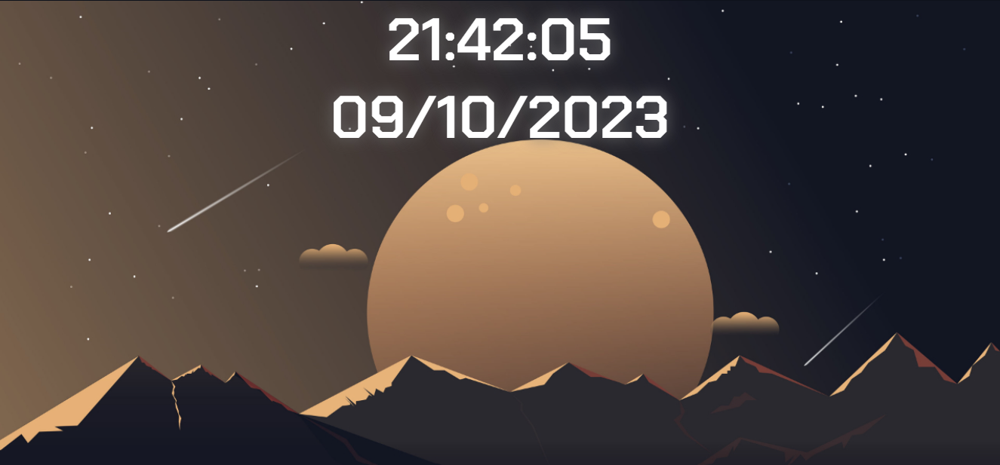

<h1 align="center">WebTick</h1>

Este é um projeto simples que exibe a hora atual, a data e ajusta o fundo da página com base no horário do dia. Durante as horas da manhã, o fundo representa o amanhecer, enquanto à noite, o fundo muda para representar o anoitecer. 

  <a href="#-tecnologias">Tecnologias</a>&nbsp;&nbsp;&nbsp;|&nbsp;&nbsp;&nbsp;
  <a href="#-projeto">Projeto</a>&nbsp;&nbsp;&nbsp;|&nbsp;&nbsp;&nbsp;
  <a href="#memo-recursos">Recurso</a>&nbsp;&nbsp;&nbsp;|&nbsp;&nbsp;&nbsp;
  <a href="#contribuição">Contribuição</a>&nbsp;&nbsp;&nbsp;|&nbsp;&nbsp;&nbsp;
  <a href="#memo-licença">Licença</a>

  

 

  

## 🚀 Tecnologias

Esse projeto foi desenvolvido com as seguintes tecnologias:

- HTML e CSS
- JavaScript
- Git e Github

## 💻 Projeto

Este é um projeto simples que exibe a hora atual, a data e ajusta o fundo da página com base no horário do dia. Durante as horas da manhã, o fundo representa o amanhecer, enquanto à noite, o fundo muda para representar o anoitecer.

- [Acesse o projeto finalizado, online](https://github.com/GabrielSantos777/WebTick)

## :memo: Recursos

- Exibe a hora, minutos e segundos atualizados em tempo real.
- Ajusta o fundo da página para representar o amanhecer ou o anoitecer com base na hora atual.

## Contribuição

Contribuições são bem-vindas! Sinta-se à vontade para criar problemas (issues) ou enviar solicitações de pull (pull requests) para melhorias ou correções.

## :memo: Licença

Esse projeto está sob a licença MIT.

---

*Este projeto foi desenvolvido por [Gabriel Santos](https://github.com/GabrielSantos777).*